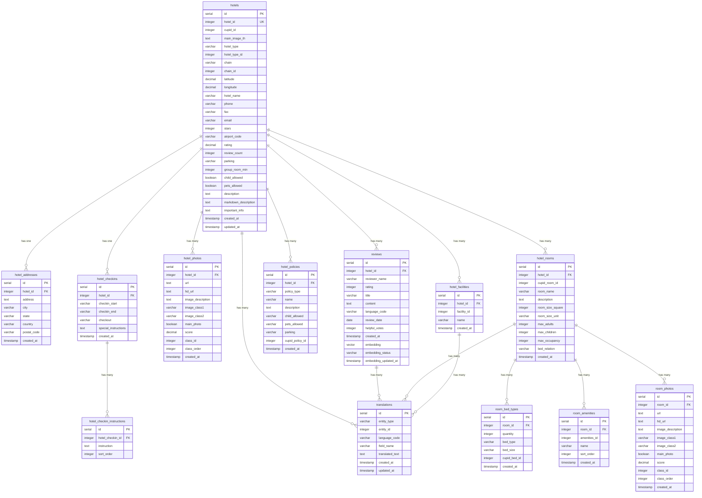

# Database Schema Documentation

## Overview
The Cupid hotel management system uses PostgreSQL with a normalized schema design to store hotel properties, reviews, translations, and related data. The schema supports multi-language content, vector search capabilities, and efficient querying for hotel management operations.

## Entity Relationship Diagram



## Table Descriptions

### Core Tables

#### `hotels` - Main hotel information
Primary table storing hotel properties with comprehensive details including location, contact information, ratings, and policies.

**Key Features:**
- Unique `hotel_id` for external reference
- `cupid_id` for Cupid API integration
- Geographic coordinates for location-based queries
- Rating and review count for hotel performance metrics
- Boolean flags for child/pet policies

**Indexes:**
- `idx_hotels_hotel_id` - Primary lookup index
- `idx_hotels_chain_id` - Chain-based queries
- `idx_hotels_location` - Geographic queries

#### `hotel_addresses` - Hotel location details
Stores detailed address information for each hotel with proper geographic hierarchy.

**Relationships:**
- One-to-one with `hotels` table
- Referenced by `hotel_id` foreign key

#### `hotel_checkins` - Check-in/check-out information
Contains check-in and check-out times along with special instructions.

**Relationships:**
- One-to-one with `hotels` table
- One-to-many with `hotel_checkin_instructions`

### Media Tables

#### `hotel_photos` - Hotel image gallery
Stores all hotel images with metadata including classification, scoring, and priority ordering.

**Key Features:**
- Support for both standard and HD image URLs
- Image classification system for categorization
- Scoring system for image quality/importance
- Main photo flag for primary image selection

**Constraints:**
- Unique constraint on `(hotel_id, url)` prevents duplicate images

#### `room_photos` - Room-specific images
Similar structure to hotel photos but specific to individual rooms.

### Facility and Policy Tables

#### `hotel_facilities` - Hotel amenities
Lists all available facilities and amenities for each hotel.

**Key Features:**
- Facility categorization with IDs
- Unique constraint on `(hotel_id, facility_id)`

#### `hotel_policies` - Hotel rules and policies
Stores various hotel policies including child, pet, and parking policies.

**Key Features:**
- Policy type categorization
- Integration with Cupid API via `cupid_policy_id`

### Room Management Tables

#### `hotel_rooms` - Room configurations
Detailed room information including capacity, size, and bed configurations.

**Key Features:**
- Maximum occupancy limits
- Room size with unit specification
- Bed relationship information

#### `room_bed_types` - Bed configurations
Specific bed types and quantities for each room.

#### `room_amenities` - Room-specific amenities
Amenities available in individual rooms.

### Content and Localization Tables

#### `translations` - Multi-language support
Flexible translation system supporting multiple languages and entity types.

**Key Features:**
- Generic entity system supporting hotels, rooms, facilities
- Language codes: 'en', 'fr', 'es'
- Field-level translation granularity
- Unique constraint prevents duplicate translations

**Usage Examples:**
```sql
-- Hotel name in French
INSERT INTO translations (entity_type, entity_id, language_code, field_name, translated_text)
VALUES ('hotel', 123, 'fr', 'name', 'Hôtel de Paris');

-- Room description in Spanish
INSERT INTO translations (entity_type, entity_id, language_code, field_name, translated_text)
VALUES ('room', 456, 'es', 'description', 'Habitación deluxe con vista al mar');
```

#### `reviews` - Customer feedback
Customer reviews with ratings, content, and AI-powered search capabilities.

**Key Features:**
- Rating validation (1-5 scale)
- Language-specific content
- Vector embeddings for semantic search
- Embedding status tracking

**AI Integration:**
- 1536-dimensional vector embeddings using OpenAI text-embedding-3-small
- HNSW index for fast similarity search
- Status tracking for embedding generation pipeline

## Database Extensions

### Required Extensions
- `uuid-ossp` - UUID generation support
- `vector` - Vector similarity search (pgvector)

### Triggers and Functions

#### `update_updated_at_column()`
Automatically updates `updated_at` timestamp when records are modified.

**Applied to:**
- `hotels` table
- `translations` table

#### `update_embedding_status()`
Tracks embedding generation status and timestamps.

**Applied to:**
- `reviews` table (embedding and embedding_status columns)

## Performance Optimizations

### Indexing Strategy
- **Primary Keys**: All tables use SERIAL primary keys for efficient joins
- **Foreign Keys**: Indexed for fast relationship queries
- **Geographic**: Composite index on latitude/longitude for location queries
- **Vector Search**: HNSW index for fast semantic similarity search
- **Status Filtering**: Partial index on embedding status for pipeline processing

### Query Optimization
- **Connection Pooling**: Configured for 25 max connections
- **Batch Processing**: Support for bulk operations in data sync
- **Efficient Joins**: Proper foreign key relationships for optimal query plans

## Data Integrity

### Constraints
- **Foreign Key Constraints**: All relationships properly enforced
- **Check Constraints**: Rating validation (1-5 scale)
- **Unique Constraints**: Prevent duplicate data where appropriate
- **NOT NULL**: Required fields properly constrained

### Cascading Deletes
- Hotel deletion cascades to all related records
- Room deletion cascades to room-specific data
- Check-in deletion cascades to instructions

## Migration Strategy

### Version Control
- Sequential migration numbering (001, 002, etc.)
- Each migration is atomic and reversible
- Proper dependency management between migrations

### Schema Evolution
- Additive changes preferred over destructive
- Backward compatibility maintained
- Proper index creation for new features

## Monitoring and Maintenance

### Health Checks
- Database connectivity verification
- Connection pool status monitoring
- Query performance tracking

### Backup Strategy
- Regular automated backups
- Point-in-time recovery capability
- Migration rollback procedures

## Security Considerations

### Data Protection
- Parameterized queries prevent SQL injection
- Input validation at application layer
- Proper access control and authentication

### Audit Trail
- `created_at` and `updated_at` timestamps
- Embedding generation tracking
- Change history through triggers
