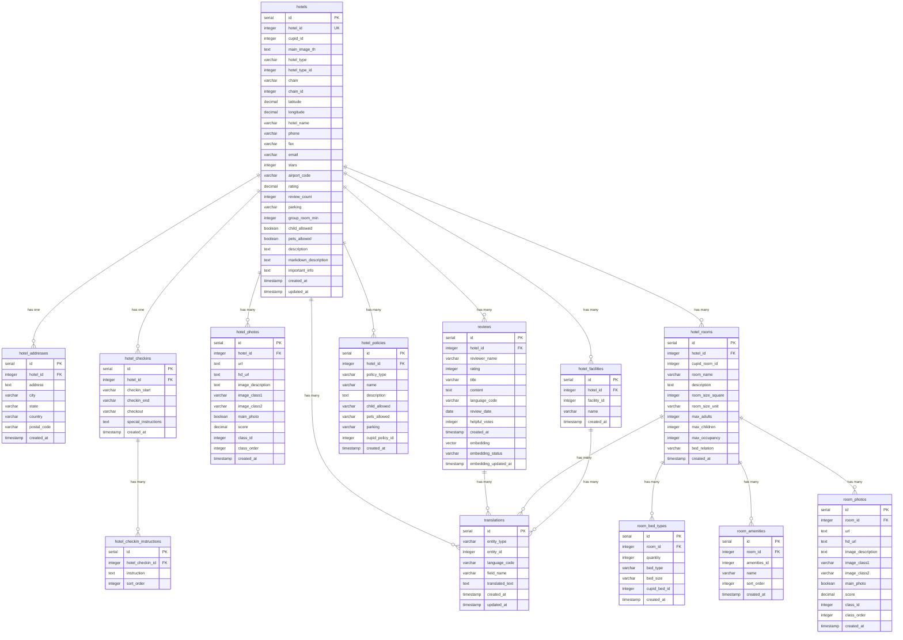

# Cupid Hotel Management System - Entity Relationship Diagram

## Interactive ER Diagram

## Key Relationships

### One-to-One Relationships
- **hotels ↔ hotel_addresses**: Each hotel has exactly one address
- **hotels ↔ hotel_checkins**: Each hotel has exactly one check-in policy

### One-to-Many Relationships
- **hotels → hotel_photos**: One hotel can have multiple photos
- **hotels → hotel_facilities**: One hotel can have multiple facilities
- **hotels → hotel_policies**: One hotel can have multiple policies
- **hotels → hotel_rooms**: One hotel can have multiple rooms
- **hotels → reviews**: One hotel can have multiple reviews
- **hotels → translations**: One hotel can have multiple translations

### Many-to-Many Relationships (via junction tables)
- **hotels ↔ translations**: Hotels can have translations in multiple languages
- **hotel_rooms ↔ translations**: Rooms can have translations in multiple languages
- **reviews ↔ translations**: Reviews can have translations in multiple languages

## Database Schema Features

### Multi-Language Support
- **translations** table supports English (en), French (fr), Spanish (es)
- Generic entity system for hotels, rooms, facilities, and reviews
- Field-level translation granularity

### AI-Powered Search
- **reviews** table includes vector embeddings (1536 dimensions)
- HNSW index for fast semantic similarity search
- Embedding status tracking for pipeline management

### Performance Optimizations
- Proper indexing on foreign keys and frequently queried fields
- Geographic indexing for location-based queries
- Vector search optimization for AI features

### Data Integrity
- Foreign key constraints with cascading deletes
- Check constraints for data validation
- Unique constraints to prevent duplicates
- Automatic timestamp management via triggers
